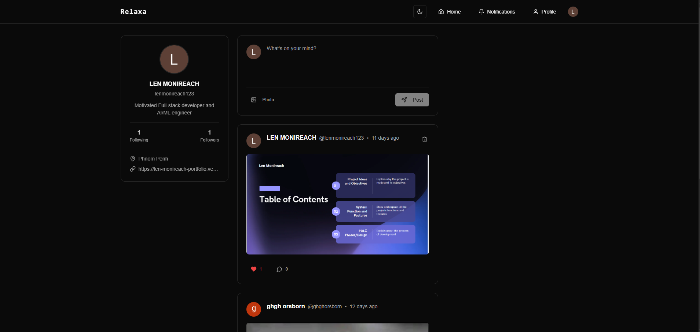

# Relaxa





A modern social media web application built with Next.js, featuring user authentication, file uploads, and a Shadcn UI.

🌐 **Live Demo:** [https://relaxa-jet.vercel.app/](https://relaxa-jet.vercel.app/)  (Refresh the page if error occurs)

📂 **Repository:** [https://github.com/monireach2480/Relaxa-Nextjs](https://github.com/monireach2480/Relaxa-Nextjs)

## Features

- 🔐 **Authentication** - Secure user authentication with Clerk
- 📁 **File Upload** - Easy file uploading with UploadThing
- 🎨 **Modern UI** - Beautiful interface built with Radix UI components
- 🌙 **Dark Mode** - Theme switching support
- 📱 **Responsive** - Mobile-first responsive design
- 🗄️ **Database** - Prisma ORM for database management

## Tech Stack

- **Framework:** Next.js
- **Language:** TypeScript
- **Styling:** Tailwind CSS
- **UI Components:** Radix UI
- **Authentication:** Clerk
- **Database:** Prisma
- **File Upload:** UploadThing
- **Icons:** Lucide React

## Getting Started

### Prerequisites

- Node.js 18+ 
- npm or yarn
- Database (PostgreSQL recommended)

### Installation

1. Clone the repository:
```bash
git clone https://github.com/monireach2480/Relaxa-Nextjs.git
cd relaxa
```

2. Install dependencies:
```bash
npm install
```

3. Set up environment variables:
```bash
cp .env.example .env.local
```

Fill in your environment variables:
```env
# Database
DATABASE_URL="your-database-url"

# Clerk Authentication
NEXT_PUBLIC_CLERK_PUBLISHABLE_KEY="your-clerk-publishable-key"
CLERK_SECRET_KEY="your-clerk-secret-key"

# UploadThing
UPLOADTHING_SECRET="your-uploadthing-secret"
UPLOADTHING_APP_ID="your-uploadthing-app-id"
```

4. Set up the database:
```bash
npx prisma db push
npx prisma generate
```

5. Run the development server:
```bash
npm run dev
```

Open [http://localhost:3000](http://localhost:3000) with your browser to see the result.

## Available Scripts

- `npm run dev` - Start development server
- `npm run build` - Build for production
- `npm run start` - Start production server
- `npm run lint` - Run ESLint
- `npm run postinstall` - Generate Prisma client

## Project Structure

```
relaxa/
├── app/              # Next.js app router
├── components/       # Reusable UI components
├── lib/             # Utility functions and configurations
├── prisma/          # Database schema and migrations
├── public/          # Static assets
└── styles/          # Global styles
```

## Environment Variables

Create a `.env.local` file in the root directory with the following variables:

| Variable | Description |
|----------|-------------|
| `DATABASE_URL` | Your database connection string |
| `NEXT_PUBLIC_CLERK_PUBLISHABLE_KEY` | Clerk publishable key |
| `CLERK_SECRET_KEY` | Clerk secret key |
| `UPLOADTHING_SECRET` | UploadThing secret key |
| `UPLOADTHING_APP_ID` | UploadThing application ID |

## Contributing

1. Fork the repository
2. Create your feature branch (`git checkout -b feature/amazing-feature`)
3. Commit your changes (`git commit -m 'Add some amazing feature'`)
4. Push to the branch (`git push origin feature/amazing-feature`)
5. Open a Pull Request

## License

This project is licensed under the MIT License - see the [LICENSE](LICENSE) file for details.

## Support

If you have any questions or need help, please open an issue on GitHub.

---

Built with ❤️ using Next.js and modern web technologies.
